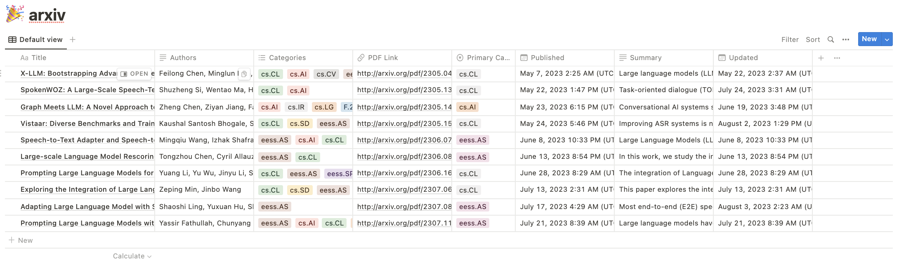

# Arxiv Notion Integration

This script integrates with the Arxiv API to perform searches and saves the results to a Notion
  



## Coming soon
 1. A service that update your notion automatically.
 2. LLM integration.
 3. More input source. e.g. News, Google Scholar, Twitter. 
 4. More output options. e.g. Twitter, GitHub, etc. 


## Or Run this locally now! (in 10 minutes)
 
### Step 1: Clone the Repository

Clone the repository containing the script to your local machine:

```bash
git clone <repository_url>
cd <repository_directory>
```

### Step 2: Install the Required Dependencies

Install the required Python packages:

```bash
pip3 install -r requirements.txt 
```

### Step 3: Get Notion API Key

1. Create an account on [Notion](https://www.notion.com) if you don't have one.
2. Create an integration [here](https://www.notion.com/my-integrations) and obtain your API key.
3. Share a page with your integration to allow it to access your data.

### Step 4: Set Up Environment Variables

Create a `.env` file in the repository directory and add the following content:

```env
NOTION_API_KEY=your_notion_api_key
```

Replace `your_notion_api_key` with the API key obtained in step 3.

### Step 5: Run the Script

Run the Python script:

```bash
python3 run_local.py
```

You'll be prompted to input the page name you've shared with the integration, and the script will handle the rest.

### Step 6: Verify the Results

Check your Notion database for the saved Arxiv search results.

## Notes:
- You have full control of your integration. Your API key and notion database is not accessible by anyone else. 
- Ensure you have the required permissions to interact with Notion databases through your integration.
- You may want to modify or extend the script to suit your specific requirements or use case. Issues and pull requests are welcomed.
